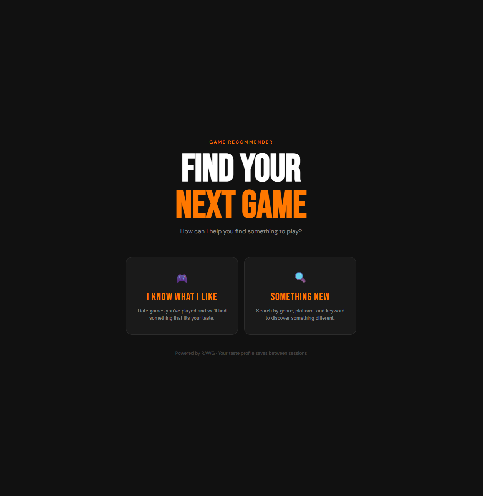
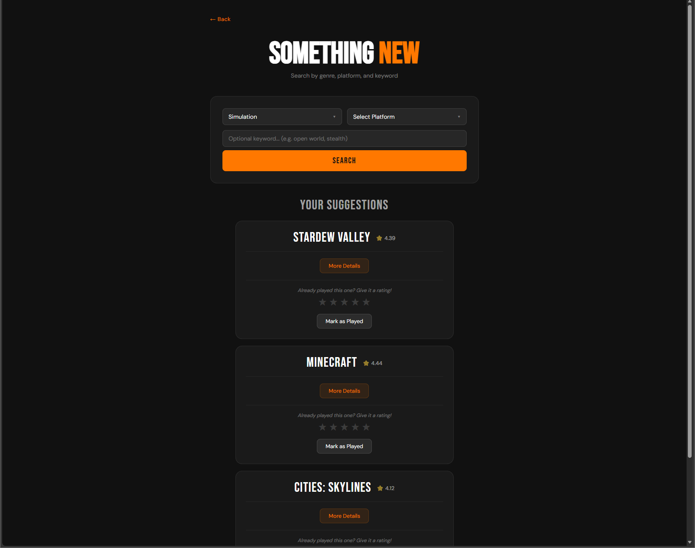
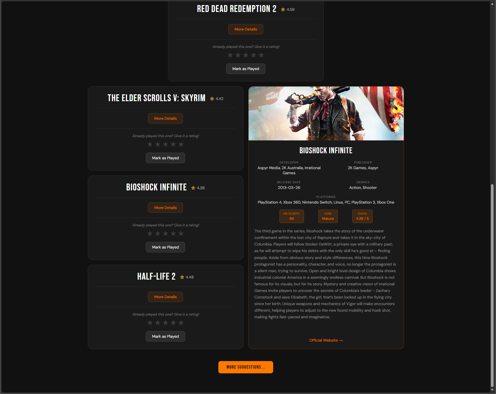
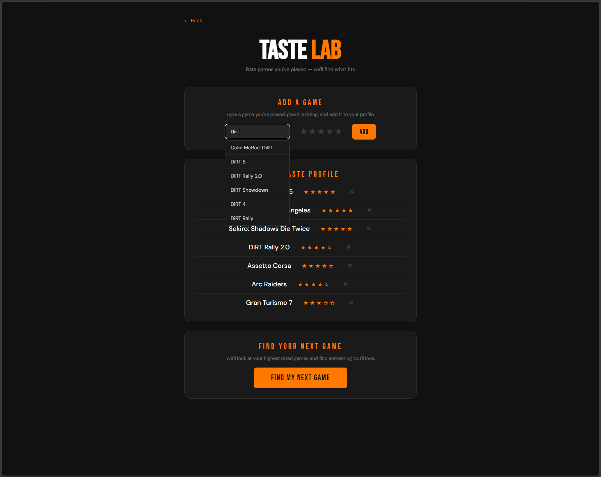

# 🎮 Game Recommender

A full stack game discovery app built with Flask, SQLite, and the RAWG API. Find your next game through two distinct paths — search by genre and platform, or build a taste profile based on games you've already rated.

---

## Screenshots

### Landing Page


### Search — Something New


### Inline Details Panel


### Taste Lab


---

## Features

**Two discovery paths:**
- **Something New** — Filter by genre, platform, and optional keyword. Results paginate in groups of 3, with a rolling window that always shows up to 6 suggestions at a time.
- **Taste Lab** — Rate games you've played (1–5 stars) to build a personal taste profile. The app analyzes your highest rated games, extracts their genres, and finds similar highly rated titles you haven't played yet.

**Inline details panel:**
- Click More Details on any result to open a side-by-side details panel without leaving the page
- Displays background art, developer, publisher, release date, genres, platforms, Metacritic score, ESRB rating, RAWG rating, description, and official website link
- Panel matches the height of the surrounding cards and closes on outside click or second button press

**Autocomplete search:**
- Taste Lab search bar queries the RAWG API in real time as you type, with a 300ms debounce to avoid hammering the API
- Dropdown suggestions appear after 3 characters and fill the input on click

**Persistent data:**
- Played games and ratings are stored in a local SQLite database and persist between sessions
- Played games are automatically filtered out of future recommendations
- Rating a game from search results saves the RAWG ID directly, enabling more accurate taste-based suggestions

**Smart filtering:**
- Horror is handled as a tag override since RAWG classifies it as a tag rather than a genre
- Results are deduplicated across paginated suggestions
- API responses are cached in memory to reduce redundant RAWG requests during a session

---

## Tech Stack

| Layer | Technology |
|---|---|
| Backend | Python, Flask |
| Database | SQLite via Python's built-in sqlite3 |
| Frontend | HTML, CSS, vanilla JavaScript |
| Template Engine | Jinja2 |
| Game Data API | RAWG Video Games Database API |
| Environment | python-dotenv |

---

## Getting Started

### Prerequisites
- Python 3.10+
- A free RAWG API key from [rawg.io](https://rawg.io/apidocs)

### Installation

1. Clone the repository:
```bash
git clone https://github.com/ToWhomImConcerned/Game-Rec-Web.git
cd Game-Rec-Web
```

2. Install dependencies:
```bash
pip install -r requirements.txt
```

3. Create a `.env` file in the project root:
```
RAWG_KEY=your_api_key_here
```

4. Run the app:
```bash
python app.py
```

5. Open your browser and go to `http://localhost:5000`

---

## Project Structure

```
Game-Rec-Web/
├── app.py              # Flask routes, database functions, API logic
├── games.db            # SQLite database (auto-created on first run)
├── requirements.txt
├── .env                # API key (not committed)
├── .gitignore
├── templates/
│   ├── landing.html    # Landing page with path selection
│   ├── search.html     # Genre/platform search and results
│   └── taste.html      # Taste lab, rating profile, taste-based results
└── screenshots/
```

---

## How the Taste System Works

When you rate a game, the app stores the game name, your star rating, and its RAWG ID. When you click **Find My Next Game**, the app:

1. Takes your top 3 highest rated games that have a RAWG ID
2. Fetches each game's full details from RAWG to extract their genres
3. Combines those genres into a single query
4. Searches RAWG for highly rated games (Metacritic 80+) in those genres
5. Filters out anything you've already played or rated
6. Returns up to 21 results, paginated in groups of 3

This means if you rate a mix of genres, your suggestions reflect that mix proportionally.

---

## Built By

Cole Burket — self-taught developer, approximately 1.5 months into coding at time of build.

This project went from zero to a full stack web application with a live API integration, persistent database, real-time autocomplete, and a custom inline details panel — all within the first 2 months of learning Python.
